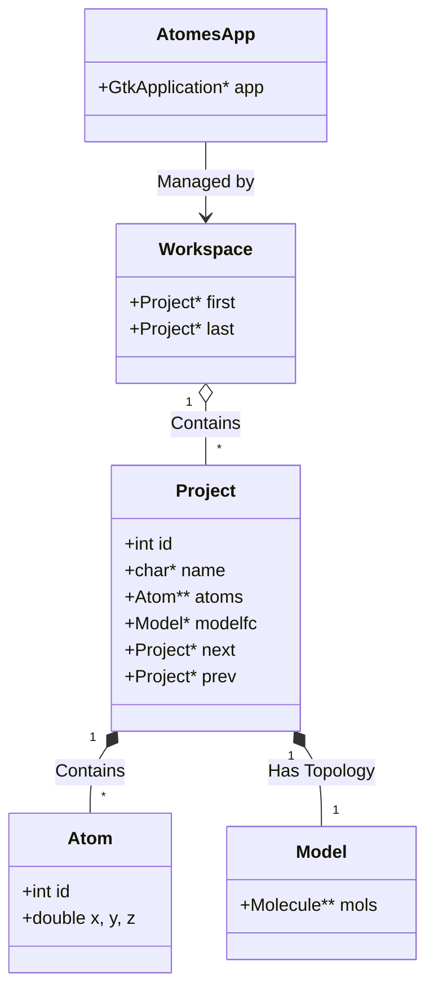
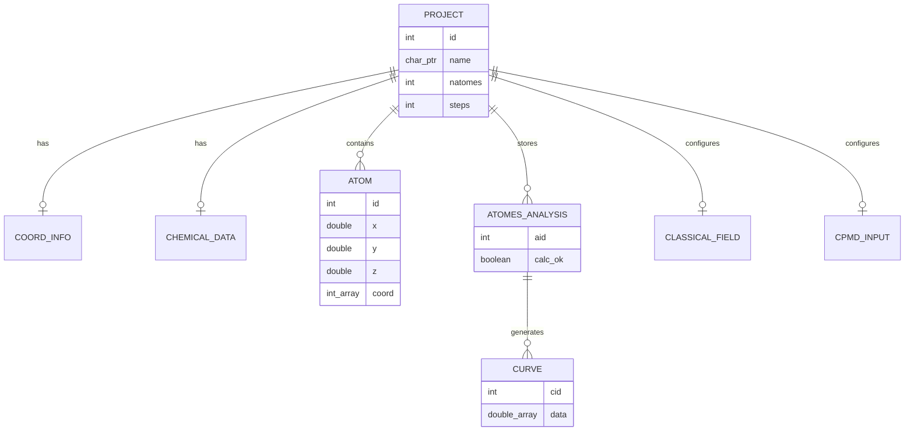
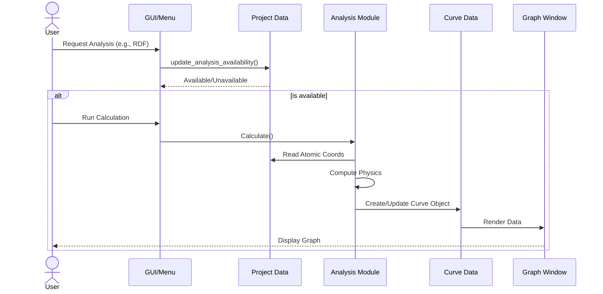

# Developer Documentation for atomes

This document provides a brief technical overview of the **atomes** software architecture  
intended for developers contributing to the project. 

It provides some guidlines to get started with [atomes][atomes] development, 
and briefly covers the internal organization, core data structures, and the implementation of key features.

To get started with [atomes][atomes] development, please give a look to the code source documentation: 

[https://slookeur.github.io/atomes-doxygen/index.html](https://slookeur.github.io/atomes-doxygen/index.html)

Please consider that: 

  - Any new file / function should include approriate description and commentary in the [Doxygen](https://www.doxygen.nl/) format
  - Changes to atomes should be submitted for review through pull-request.

Documentation is available to help you with:

  - [Adding a new C code routine to the **atomes** program][new_routine]
  - [Adding new source code file(s) to the **atomes** program][new_file]
  - [Adding a new analysis to the **atomes** program][new_analysis] to make use of the graph visualization system

## Internal organization

The application is built around a hierarchical structure managed by global state variables. The core hierarchy is:

**Application -> Workspace -> Project -> Model -> Atom**

### Global state (`global.h`)

The application state is maintained through several key global variables defined in `src/global.h`:

- **`AtomesApp`**: The main GTK application instance.
- **`workzone`**: The global `workspace` structure containing all open projects.
- **`active_project`**: Pointer to the currently selected `project`.
- **`active_glwin`**: Pointer to the active OpenGL widget (`glwin`).
- **`active_chem`**, **`active_coord`**, **`active_cell`**: Shortcuts to the chemical data, coordination info, and unit cell of the active project.

### Workspace and projects

- **Workspace** (`struct workspace`): A doubly linked list acting as a container for all open projects (`first` and `last` pointers).
- **Project** (`struct project`): The central data structure that contains:
    - **Metadata**: Name, ID, file paths.
    - **Simulation Data**: `natomes` (atom count), `steps` (MD steps), `box` (simulation box).
    - **Core Data Pointers**:
        - `atoms`: 2D array of `atom` pointers (`atoms[step][atom_index]`).
        - `coord`: Coordination statistics.
        - `chemistry`: Chemical properties.
        - `analysis`: Analysis results.
    - **UI Elements**: OpenGL widget (`modelgl`), text buffers.
    - **Linked List**: `next` and `prev` pointers for workspace navigation.

## Core data structures

### Atom (`struct atom`)

The fundamental unit of data.
- **Identification**: `id` (index), `sp` (species index).
- **Position**: `x`, `y`, `z` coordinates.
- **Topology**:
    - `numv`: Number of neighbors.
    - `vois`: Array of neighbor IDs.
    - `coord`: Array storing coordination numbers (total, partial, fragment ID, molecule ID).
- **Visual State**: Flags for `show`, `pick` (selected), `label`.

### Molecule (`struct molecule`) & Model (`struct model`)

Used for analyzing connectivity beyond simple bonds.
- **Model**: Represents the topology for the entire system, containing a list of molecules per step.
- **Molecule**: Contains a list of `fragments` (connected components) and `atoms` comprising the molecule.

### Coordinates file (`struct coord_file`)

Used during I/O operations to parse different file formats (XYZ, PDB, CIF, etc.).
- Stores raw data (`coord`, `z` numbers) before it is processed into the `project` structure.
- Handles crystallographic data like symmetry positions and Wyckoff positions (for CIF).

### Curve (`struct Curve`)

A versatile structure for 2D plotting (used in Analysis and properties display).
- **Data**: `data[2]` (X/Y arrays), `err` (error bars).
- **Layout**: Stores axis limits, titles, colors, legends, and rendering styles.
- **UI**: Embedded `GtkWidget * plot` drawing area.

### Analysis (`struct atomes_analysis`)

Manages the state and results of various physical analyses (RDF, XRD, etc.).
- **`aid`**: Analysis ID (e.g., 0 for g(r), 1 for S(q)).
- **State**: Flags for availability (`avail_ok`) and calculation status (`calc_ok`).
- **Results**: Contains pointers to `Curve` structures holding the computed data.

## Key features implementation

### MD input preparation

**atomes** assists in preparing inputs for MD codes (DL_POLY, LAMMPS, CPMD, CP2K). 
These are managed via specific structures linked in `struct project`:
- **`classical_field`**: Stores force field parameters, potentials, and system settings for classical MD.
- **`cpmd` / `cp2k`**: Stores DFT/ab-initio specific parameters (functional, basis sets, pseudopotentials).

### Analysis workflow

1.  **Availability**: `update_analysis_availability()` checks if an analysis is possible based on current data (e.g., periodic boundary conditions).
2.  **Calculation**: Triggered by user actions. Results are typically stored in `atomes_analysis` structs.
3.  **Visualization**: Results are converted into `Curve` objects for plotting in the GUI.

### Visualization (OpenGL)

- **`glwin`**: The core widget for 3D rendering.
- **Rendering**: Uses OpenGL calls (often legacy GL or epoxy). The `project` struct contains `modelgl`, which links the data to the visual representation.
- **Interaction**: Mouse events on `glwin` drive selection (`pick` flag in `atom`) and camera manipulation.

## Source code map

- **`src/global.h`**: Main header with all struct definitions.
- **`src/project/`**: Project management logic (`project.c`, `project.h`).
- **`src/workspace/`**: Workspace management (`workspace.c`, `workspace.h`).
- **`src/calc/`**: Analysis implementations.
- **`src/opengl/`**: Rendering code.
- **`src/gui/`**: GTK interface construction.
